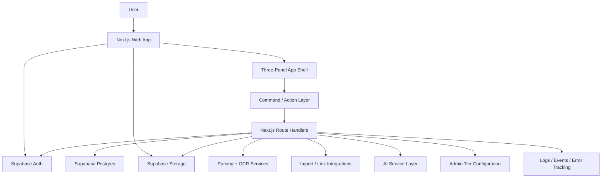

# Architecture

This document describes the intended architecture for ResumAI before feature implementation expands.

## 1. Product Summary

ResumAI is an AI-powered job application assistant.

V1 helps a user:

1. Sign up or log in.
2. Build a profile through conversation, natural-language input, uploads, and links.
3. Enrich the profile from resumes, credentials, experience, accolades, LinkedIn/profile links, portfolio pages, and common file formats.
4. Receive proactive role-fit and seniority recommendations.
5. Acknowledge or adjust the target direction.
6. Generate an ATS-friendly master resume that preserves a hint of the user's voice.
7. Paste a job URL into the conversation.
8. Validate the job against the user's profile.
9. Log the opportunity as an application if the user chooses to proceed.
10. Generate and save a role-specific ATS-friendly resume and cover letter as downloadable PDF artifacts.
11. Track application status.

## 2. Current Infrastructure

- GitHub: `ninemush/ResumAI`.
- Vercel project: `resum-ai/ai-resume-app`.
- Supabase project: `ResumAI`.
- Supabase project ref: `raqsevuqlwofhgljiazv`.
- Cursor: primary IDE.
- Codex: assistant/agent inside Cursor workflow.

## 3. Current Codebase

Current scaffold:

- Next.js App Router.
- TypeScript.
- Tailwind CSS.
- ESLint.
- Local Supabase CLI config.
- Local Vercel CLI dependency.
- Local Supabase CLI dependency.

No production product features should be added until `DEVELOPMENT_CONTRACT.md` and this architecture are accepted.

## 4. High-Level System



## 5. Proposed Directory Structure

Current project uses the default Next.js `app/` directory. As product code grows, use this structure:

```text
app/
  api/
  admin/
  auth/
  dashboard/
components/
  app-shell/
  conversation/
  profile/
  ui/
  workflow/
lib/
  ai/
  api/
  auth/
  commands/
  db/
  integrations/
  observability/
  parsing/
  security/
  tiers/
  validation/
supabase/
  migrations/
  policies/
```

Future mobile-aware structure may evolve to:

```text
apps/
  web/
  mobile/
packages/
  core/
  api-contracts/
  validation/
  ai/
  design-system/
```

Do not move to a monorepo until there is a concrete native mobile milestone.

## 6. Cross-Platform Architecture

The web app must not trap business logic in browser-only components.

Shared and portable:

- Data types.
- Validation schemas.
- Prompt contracts.
- AI output schemas.
- Resume/job parsing interfaces.
- API client contracts.
- Permission rules.
- Audit event definitions.

Platform-specific:

- Web pages.
- Native screens.
- File-picker UI.
- Browser-specific rendering.
- Native mobile navigation.

Future native mobile should reuse the same backend, validation contracts, AI orchestration contracts, and domain services.

## 6.1 Command And Action Architecture

User intent must be routed through a single action path.

For any meaningful operation, create one shared command/service entry point and let all interfaces call it.

Examples:

- A button click, keyboard shortcut, and future natural-language command for job analysis must all call the same job-analysis command.
- A web upload flow and future native upload flow must share the same validation, metadata, storage, and database contract.
- A manual retry button and automatic retry policy must use the same retry-safe service boundary.

Required layers:

```text
UI event or command input
  -> action/command handler
  -> validation
  -> authorization
  -> domain service
  -> persistence/provider adapter
  -> observability
```

Rules:

- UI components must not duplicate domain logic.
- API routes must not duplicate domain logic.
- Natural-language command handling must not bypass typed validation.
- Shared behavior belongs in `lib/` or a future shared package.
- Provider-specific code must sit behind adapters.
- Tests must target the shared service path, not only the UI event that triggered it.

V1 command examples:

- `profile.ingestSource`
- `profile.updateField`
- `profile.recommendRoles`
- `resume.generateMaster`
- `job.ingestPosting`
- `job.evaluateFit`
- `application.create`
- `application.generateArtifacts`
- `application.updateStatus`
- `tier.checkQuota`
- `tier.consumeQuota`

Button clicks, direct editor saves, file uploads, pasted URLs, and conversational AI requests must call these shared command paths rather than separate implementations.

## 7. Data Model Draft

Final schema requires approval before implementation.

### `profiles`

Purpose: user profile metadata and current career positioning.

Fields:

- `id`
- `user_id`
- `display_name`
- `headline`
- `summary`
- `target_direction`
- `target_level`
- `profile_status`
- `created_at`
- `updated_at`

Controls:

- RLS by `auth.uid() = user_id`.
- User can read/update own profile only.

### `profile_sources`

Purpose: source material used to build the profile.

Fields:

- `id`
- `user_id`
- `source_type`
- `source_url`
- `storage_path`
- `original_filename`
- `mime_type`
- `extracted_text`
- `extraction_status`
- `created_at`
- `updated_at`

Controls:

- RLS by `auth.uid() = user_id`.
- Supports PDF, DOCX, TXT, JPG/PNG/common images via OCR, public links, and future authenticated integrations.
- User may delete non-application-dependent sources.

### `profile_facts`

Purpose: normalized facts inferred or provided for a profile.

Fields:

- `id`
- `user_id`
- `profile_id`
- `fact_type`
- `fact_value`
- `source_ids`
- `confidence`
- `user_confirmed`
- `created_at`
- `updated_at`

Controls:

- Facts must distinguish user-provided, imported, inferred, and confirmed data.
- AI must not treat unconfirmed inferences as hard facts.

### `generated_resumes`

Purpose: generated master resumes and job-specific resumes.

Fields:

- `id`
- `user_id`
- `profile_id`
- `application_id`
- `resume_type`
- `storage_path`
- `content_json`
- `pdf_storage_path`
- `status`
- `created_at`
- `updated_at`

Controls:

- RLS by `auth.uid() = user_id`.
- Generated artifacts are personal data.
- Job-specific generated artifacts connected to logged applications must follow audit retention rules.

### `job_ingestions`

Purpose: job URL ingestion and extracted job data.

Fields:

- `id`
- `user_id`
- `job_url`
- `resolved_url`
- `title`
- `company`
- `extracted_text`
- `status`
- `created_at`
- `updated_at`

Controls:

- RLS by `auth.uid() = user_id`.
- URL input validation.
- SSRF protections before launch.

### `role_recommendations`

Purpose: proactive role-family, function, industry, and seniority recommendations.

Fields:

- `id`
- `user_id`
- `profile_id`
- `role_family`
- `role_titles`
- `seniority_level`
- `rationale`
- `confidence`
- `user_acknowledged`
- `created_at`
- `updated_at`

Controls:

- Recommendations must identify assumptions and ask for user acknowledgement.

### `applications`

Purpose: logged application opportunities and status tracking.

Fields:

- `id`
- `user_id`
- `profile_id`
- `company_name`
- `job_title`
- `job_url`
- `job_ingestion_id`
- `status`
- `quota_event_id`
- `created_at`
- `updated_at`

Statuses:

- `draft`
- `applied`
- `no_reply`
- `rejected`
- `interview_in_progress`
- `interviewed_not_selected`
- `interviewed_selected`
- `withdrawn`

Controls:

- Application records connected to quota usage are retained for audit-safe usage justification.
- User may update status.

### `generated_cover_letters`

Purpose: generated job-specific cover letters.

Fields:

- `id`
- `user_id`
- `application_id`
- `prompt_version`
- `model`
- `content`
- `pdf_storage_path`
- `status`
- `created_at`

Controls:

- RLS by `auth.uid() = user_id`.
- Output must pass schema validation.
- No generated facts beyond provided source material.

### `tiers`

Purpose: configurable user tier definitions.

Fields:

- `id`
- `name`
- `description`
- `application_limit`
- `generation_limit`
- `is_active`
- `created_at`
- `updated_at`

Controls:

- Admin-only writes.
- Changes are configuration changes, not code changes.

### `user_tiers`

Purpose: assign users to tier configurations.

Fields:

- `id`
- `user_id`
- `tier_id`
- `starts_at`
- `ends_at`
- `status`
- `created_at`
- `updated_at`

Controls:

- Users can read own tier status.
- Admin-only assignment changes.

### `quota_events`

Purpose: audit-safe quota consumption records.

Fields:

- `id`
- `user_id`
- `tier_id`
- `event_type`
- `resource_type`
- `resource_id`
- `amount`
- `period_start`
- `period_end`
- `created_at`

Controls:

- Append-only.
- Used to justify application quota consumption.

### `audit_events`

Purpose: trace product and security-relevant events.

Fields:

- `id`
- `user_id`
- `event_type`
- `resource_type`
- `resource_id`
- `request_id`
- `metadata`
- `created_at`

Controls:

- Append-only from server-side code.
- No raw resumes or secrets in metadata.

## 8. API Contracts Draft

Final schemas must be defined with TypeScript validation before implementation.

### Resume Upload

Flow:

1. Authenticated user selects file.
2. File is uploaded to private Supabase Storage.
3. Server records metadata in `resumes`.
4. Parser extracts text asynchronously or synchronously depending on file type and reliability.

Requirements:

- Accept only approved file types.
- Enforce max file size.
- Store in user-scoped path.
- Never expose another user's file path.

### Profile Source Ingestion

Route:

```text
POST /api/profile/sources
```

Accepted inputs:

- Natural-language text.
- PDF.
- DOCX.
- TXT.
- JPG, PNG, and common image formats with OCR.
- Public links.
- Future authenticated LinkedIn/job-site/company-site integrations.

Requirements:

- Authenticated user only.
- Source type validation.
- File type and size validation.
- OCR and parsing status tracking.
- Extract facts into profile via the same profile command layer used by direct edits and conversation.
- User can confirm, correct, or delete profile facts.

### Role Recommendation

Route:

```text
POST /api/profile/recommendations
```

Requirements:

- Authenticated user only.
- Requires enough confirmed or high-confidence profile signal.
- Returns role families, sample titles, seniority guidance, rationale, confidence, and open questions.
- Must request user acknowledgement before final target direction is used for resume generation.

### Job URL Ingestion

Route:

```text
POST /api/jobs/ingest
```

Requirements:

- Authenticated user only.
- Validate URL.
- Block private network and localhost URLs before production.
- Apply timeout.
- Extract readable text.
- Store ingestion record.
- Return structured status.

### AI Generation

Route:

```text
POST /api/generations
```

Requirements:

- Authenticated user only.
- Requires owned resume and owned job ingestion.
- Uses versioned prompt.
- Returns schema-validated output.
- Logs model, prompt version, duration, and status.

### Application Logging

Route:

```text
POST /api/applications
```

Requirements:

- Authenticated user only.
- Requires quota check.
- Creates quota event when the application consumes a tier allocation.
- Stores company, job title, posting URL, related job ingestion, status, and generated artifact references.
- Must not be deletable in a way that erases required quota/audit evidence.

### Admin Tier Configuration

Route group:

```text
/api/admin/tiers
```

Requirements:

- Admin-only.
- Configuration-driven tier creation and updates.
- Server-side enforcement.
- Audited changes.

## 9. Security Architecture

Controls:

- Supabase Auth for identity.
- Supabase RLS for database authorization.
- Private Supabase Storage for resumes.
- Server-side API validation.
- Server-side AI key usage only.
- No service-role key in browser.
- Rate limiting for upload, ingestion, and generation.
- SSRF protection for URL ingestion.
- File type and size validation for uploads.
- Audit events for sensitive operations.
- Admin-only authorization for tier configuration.
- Quota enforcement cannot rely on client state.
- Integration tokens for LinkedIn/job boards/company career sites must be encrypted and scoped when future integrations are implemented.

## 10. Privacy Architecture

Personal data categories:

- Email/account identity.
- Resume content.
- Uploaded files.
- OCR extracted profile source text.
- Imported profile and credential data.
- Job URLs connected to a user.
- Generated career materials.
- Application records and status history.
- Tier and quota usage events.

Privacy controls:

- Data minimization.
- Explicit purpose.
- User-scoped access.
- Deletion plan.
- Export plan.
- Retention plan.
- Subprocessor list before launch.
- Region and cross-border transfer notes before launch.

## 11. AI Architecture

AI modules must be isolated under `lib/ai`.

Required boundaries:

- `prompts/`: versioned prompt templates.
- `schemas/`: AI response schemas.
- `providers/`: OpenAI/Claude adapters.
- `generation-service`: orchestration and validation.

AI service must:

- Refuse to invent resume facts.
- Cite source material internally when generating structured outputs.
- Fail gracefully.
- Keep human review in the workflow.
- Maintain warm, candid, patient, job-advisor tone.
- Adapt to user frustration by becoming calmer, more concise, and more action-oriented.
- Ask questions conversationally, not interrogatively.
- Proactively recommend roles and levels when profile confidence is sufficient.

Conversational AI is the main product interface. Forms and editors support the conversation, but all changes must route through the same command/service layer.

## 12. Observability Architecture

Before public launch:

- Structured server logs.
- Error tracking.
- Request ids.
- Audit events table.
- AI latency and failure metrics.
- Basic funnel events.

Sensitive data must be excluded from logs.

## 12.1 Failure Intelligence Architecture

The system must support self-detection, self-diagnosis, and safe self-healing.

Detection:

- Monitor upload, parsing, ingestion, AI generation, and database failures.
- Detect invalid AI response shape.
- Detect low-confidence or low-content parsing results.
- Detect repeated user-facing failures.

Diagnosis:

- Normalize errors into typed failure categories.
- Include request id, feature name, status, duration, and safe metadata.
- Separate user-facing messages from internal diagnostics.
- Preserve root cause when available.

Healing:

- Retry safe idempotent operations with bounded retries.
- Provide fallback states when AI or parsing fails.
- Surface user recovery actions.
- Log persistent failure patterns for engineering review.

No self-healing process may rewrite code, alter schemas, weaken policy, or change prompts outside the reviewed release process.

## 13. UX Architecture

UX principles:

- Contemporary, calm, elegant.
- Warm and airy.
- Fast core workflow.
- Mobile-first.
- Responsive desktop layout.
- Browser-compatible across Chrome, Safari, Firefox, and Edge.
- Accessible forms and navigation.
- Clear review-before-use stage.
- Conversation-first with supportive direct editing.

Design system direction:

- Warm neutral base surfaces.
- Strong readable contrast.
- One restrained primary accent.
- Semantic success/warning/error colors.
- Consistent spacing scale.
- Reusable form and status components.
- No novelty UI that slows down the core workflow.

Desktop layout:

- Left navigation: product areas and application history.
- Center console: profile explorer/editor, recommendations, application artifacts.
- Right panel: conversational AI and next-best action.

Mobile adaptation:

- Prefer chat-first flow.
- Profile explorer/editor and application details can become tabs, sheets, or drill-in screens.
- Mobile must reuse backend, command layer, validation, AI orchestration, tier checks, and audit logic.

## 14. Deployment Architecture

Vercel:

- Production branch: `main`.
- Preview deployments: pull requests and non-production branches.
- Environment variables must exist for development, preview, and production.

Supabase:

- Remote project linked.
- Migrations must be source-controlled.
- RLS policies must be source-controlled.
- Manual dashboard changes must be reflected in migrations.

## 15. Current Gaps

Before building V1 features:

- Approve `DEVELOPMENT_CONTRACT.md`.
- Approve this architecture.
- Resolve GitHub history divergence.
- Add `OPENAI_API_KEY` when AI work begins.
- Decide initial database schema.
- Create first Supabase migration.
- Define API schemas.
- Define design tokens.
- Add basic CI.
- Define command/action handler pattern.
- Define test strategy and tool choices for unit, API, regression, browser, and mobile viewport testing.
- Define typed error taxonomy for self-detection and self-diagnosis.
- Finalize tier seed names and quota limits.
- Define retention policy for applications, generated artifacts, and quota audit records.
- Define OCR/link ingestion provider approach.
- Define LinkedIn/job-site integration boundary for V1 versus future authenticated integrations.
