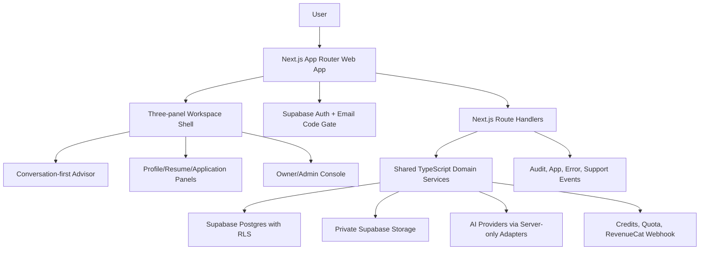

# Architecture

This document describes the current V1 architecture for the application currently branded as Pramania. Product-facing code must continue to use `lib/brand.ts` rather than hardcoded brand names.

## 1. Product Summary

Pramania is a conversation-first job application assistant. V1 helps a user build a career profile from conversation, files, OCR-ready images, public links, and direct edits; generate an ATS-friendly master resume; evaluate job URLs or pasted job descriptions; log chosen applications; generate job-specific resume and cover letter artifacts; track application outcomes; and use one-time credit packs for paid operations.

V1 is deliberately bounded. It does not include subscriptions, auto-renewal, auto-refill, stored payment method management, enterprise invoicing, marketplace billing, auto-apply, job scanning, browser automation, native mobile release, authenticated third-party integrations, or employer submission workflows.

## 2. Deployed System

- Repository: `ninemush/ResumAI`.
- Production branch: `main`.
- Production site: `https://pramania.com`.
- Vercel project: `resum-ai/ai-resume-app`.
- Supabase project: `ResumAI` (`raqsevuqlwofhgljiazv`).
- Current verified production SHA before this hardening pass: `2d5f038a56a2ee13df44c78b1abe2893ea674d60`.
- Release metadata endpoint: `GET /api/release`, public and non-secret.

Normal production releases are Git-connected Vercel deployments from `main` after a PR merge. Manual archive deploys are reserved for owner-approved emergency rollback or hotfix use and must provide release metadata fallback variables.

## 3. Runtime Architecture

The app uses Next.js App Router, TypeScript, React client components for interactive workspace surfaces, and route handlers for API boundaries. Server code owns secrets, payment processing, AI provider calls, quota checks, storage writes, and database mutations.

## 4. Application Shell

The signed-in workspace is organized around:

- Left navigation for Home, Profile & Resume, Jobs, Applications, Library, Credits, Settings, Support, and owner access where authorized.
- Center workspace panels for profile exploration/editing, source library, resume review, job review, application materials, credits, settings, support, and owner operations.
- Right conversation panel for primary natural-language intake, file/link/job submission, advisor responses, and guided next actions.

Mobile keeps the same information architecture through chat-first navigation, workspace tabs/drawers, and shared service routes. Mobile does not introduce duplicate business logic.

## 5. Supabase Auth, Database, And Storage

Supabase Auth is the identity source. Signed-in UX requires an email-code posture through the app cookie gate when configured. User data tables use RLS, user ownership, and server-side validation. Service-role access is limited to server-only code paths and QA/launch tooling.

Supabase Postgres stores profiles, profile sources, profile facts, career profiles, role recommendations, job ingestions, applications, generated resumes, generated cover letters, quota events, credit ledger entries, credit reservations, RevenueCat event records, reversal records, support records, audit events, app events, and owner metrics inputs.

Supabase Storage is private by default. Resume/source uploads, generated PDFs/DOCX files, and optional profile photos are stored in user-scoped paths unless a specific public asset is approved.

## 6. Billing, Credits, Quota, And RevenueCat

V1 payments are one-time credit packs through the configured RevenueCat/Stripe checkout and webhook flow. The app does not store payment methods.

The credit model includes:

- `credit_ledger` as append-only accounting evidence.
- `credit_reservations` for paid-operation idempotency and safe retries.
- `credit_operation_outputs` for output linkage and retry reuse.
- `revenuecat_events` for provider event idempotency and reconciliation.
- `credit_reversals` for refund/reversal metadata without granting credits.
- Server-computed operation fingerprints for paid and quota-protected operations.

RevenueCat purchase events are granted through `process_revenuecat_credit_event` exactly once. Unknown products are recorded as ignored without granting credits. Refund/reversal/chargeback events are recorded as reversal metadata and linked to the latest matching purchase ledger where possible.

Quota enforcement is server-side through tier configuration, `quota_events`, `quota_reservations`, and operation fingerprints. The same idempotency key with a different server-computed fingerprint is rejected for paid and quota-protected operations.

## 7. AI And Generation Architecture

AI logic is isolated in server-side modules under `lib/ai`, profile, resume, job, and application service boundaries. AI outputs are assistive drafts and must be grounded in user-provided or user-confirmed evidence. Generated resumes and cover letters must not invent employers, credentials, dates, claims, or outcomes.

Generated artifacts follow a review-before-use posture. PDF/DOCX export readiness requires content validation, claim-risk review where applicable, storage success, and download readiness before files are presented as ready.

## 8. Owner/Admin And Support Surfaces

Owner/admin is in V1 and remains server-authorized and RLS-backed. Owner surfaces include operating metrics, user lists, support queues, billing/credit visibility, compliance posture, tier configuration, promo codes, direct credit grants, platform status, artifact cleanup, and launch/operations evidence.

Trust-critical owner actions use in-app dialogs rather than native browser prompts. These dialogs preserve audit context, show consequences, and confirm credit/quota or data-export impact before action.

Support includes L0 self-serve posture, L1 autonomous support boundaries, and L2 human escalation for refunds, legal/privacy/security, account access, sensitive disputes, unresolved issues, and user distress. Support-safe context excludes unnecessary raw personal content by default.

## 9. Security And Privacy Controls

Required controls:

- Supabase Auth and RLS for user data.
- Server-side validation for every mutation and external input.
- No service-role keys or provider secrets in browser code.
- Private storage by default.
- Rate limiting for public and expensive routes.
- SSRF protections for URL ingestion.
- Audit events for sensitive and admin operations.
- Operation fingerprints for idempotent paid/quota-protected actions.
- Privacy deletion/minimization flows that retain only audit-safe billing/quota evidence where required.
- No sensitive data in client logs, server logs, analytics, or error traces.

## 10. Launch Gates And Evidence

Launch-readiness evidence is collected through:

- `npm run lint`
- `npm run typecheck`
- `npm run test:unit`
- `npm run build`
- `npm run test:e2e:smoke`
- `npm run test:e2e:accessibility`
- `npm run test:e2e:cross-browser`
- `npm run test:e2e:launch-readiness`
- `npm run release:preflight`
- `npm run release:state`
- `npm run release:verify`

Launch-gated checks require `RUN_LAUNCH_READINESS_GATES=1`, email-code auth posture, Supabase-backed rate limiting, RevenueCat webhook secret, QA user A/B credentials, QA admin credentials, and service-role credentials. Secrets must not be printed or committed. Screenshots, traces, command summaries, and launch evidence belong under untracked `qa-artifacts/`.

## 11. Rollback Model

Rollback options are:

- Revert the production PR commit and redeploy `main`.
- Redeploy the last known good Vercel production deployment.
- Disable or restore configuration such as tiers, quotas, support automation, or launch gates where applicable.
- Use forward-fix migrations for database changes when down migration is unsafe.

Rollback is required or strongly considered for suspected cross-user data exposure, broken RLS/auth, duplicated or missing quota/credit events, artifacts assigned to the wrong user, exposed secrets, unsafe generated claims at scale, or production provenance mismatch.

## 12. V1 Non-Goals

Do not add these without explicit approval:

- Subscriptions, automatic renewals, auto-refills, stored payment methods, enterprise invoicing, or marketplace billing.
- Auto-apply, semi-auto apply, job scanning, browser automation, or employer submission workflows.
- Native mobile release.
- Authenticated LinkedIn, job-board, company career-site, or other third-party integrations.
- Workflows that submit data to an employer without explicit human approval.
